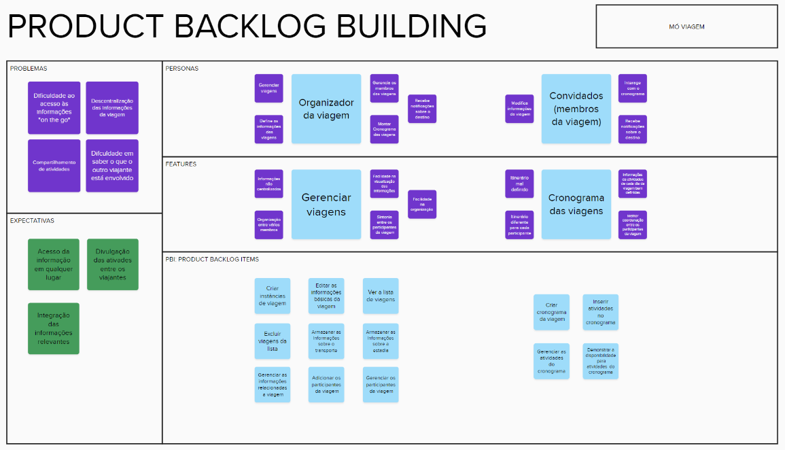

# PBB e BDD

## PBB

Como parte das entregas da disciplina na Unidade 3, foi criado do zero um novo backlog a partir do PBB (Product Backlog Building), com escopo reduzido comparado ao Backlog utilizado no projeto.

[Link do Mural para uma melhor visualização](https://app.mural.co/t/unb9171/m/unb9171/1683643223760/8c24a764192b34855b7c5ad855dacdc7e5f25e13?sender=ueeaf0301241260f6a07d2699)

A partir dos campos definidos pelo PBB, como Personas, Benefícios de funcionalidades e PBIs(Product Backlog Items), foram criadas User Stories e seus respectivos BDDs (Behavior Driven Development), que servem como critérios de aceitação.

As User Stories foram mapeadas assim:

- Eu, como {persona} posso {PBI} para {benefício}.

Os BDDs foram construídos deste modo:

- Dado que {contexto inicial}
- Quando {evento ou ação}
- Então, {resultado esperado}

## User Stories e BDD

 

- Eu, como organizador da viagem, posso criar instâncias de viagem para facilitar o acesso à informações.
      - Dado que o usuário tenha uma conta cadastrada
      - Quando ele preencher todos os campos corretamente, com 16/06/2023 (data de início), 20/06/2023 (data de término), Paris (local), 3 (quantidade de pessoas)
      - Então uma viagem deverá ser criada e enviada uma mensagem “Viagem criada com sucesso”
    
- Eu, como organizador da viagem, posso editar as informações básicas da viagem para facilitar a organização.

      - Dado que o usuário tenha uma viagem criada
      - Quando ele tentar editar alguma informação desta viagem e preencher os campos que deseja editar, como 24/06/2023 (data de término), Barcelona (local)
      - Então o sistema deve atualizar as informações dos campos que o usuário editou (no caso, data de término e local)

    

- Eu, como organizador da viagem, posso ver a lista de viagens para facilitar minha organização.

      - Dado que um usuário tenha pelo menos uma viagem criada
      - Quando ele tentar visualizar suas viagens
      - Então ele deverá ver uma lista de todas as suas viagens criadas, com cada viagem sendo identificadas pelo seu local, data de início e data de término

    

- Eu, como organizador da viagem, posso excluir viagens da lista de viagens para facilitar minha organização.

      - Dado que um usuário tenha pelo menos uma viagem criada
      - Quando ele for visualizar a lista de suas viagens e clique no botão de excluir uma determinada viagem
      - Então a viagem excluída deverá desaparecer de sua lista e ter as informações relevantes apagadas

    

- Eu, como organizador da viagem, posso armazenar as informações sobre meu transporte para facilitar o acesso à informações.

      - Dado que um usuário tenha pelo menos uma viagem criada
      - Quando ele tentar adicionar um transporte à uma viagem e preencher os campos corretamente, com Avião (tipo de transporte), 599,00 (preço), 11:00 (hora de saída), 15:30 (hora de chegada)
      - Então o transporte relacionado à esta viagem deve ser cadastrado e é exibida a mensagem “Transporte cadastrado com sucesso”

    

- Eu, como organizador da viagem, posso armazenar as informações sobre minha estadia para facilitar o acesso à informações.

      - Dado que um usuário tenha pelo menos uma viagem criada
      - Quando ele tentar adicionar uma estadia à uma viagem e preencher os campos corretamente, com Hotel (tipo de estadia), 259,99 (preço), Rua São Pedro, lote 54 (localização), 21/06/2023 (data de entrada), 25/06/2023 (data de saída)
      - Então a estadia relacionada à esta viagem deve ser cadastrada e é exibida a mensagem “Estadia cadastrado com sucesso”

    

- Eu, como organizador da viagem, posso gerenciar as informações sobre a viagem para facilitar minha organização.

      - Dado que um usuário tenha pelo menos uma viagem criada e pelo menos um transporte e/ou estadia associados a esta viagem
      - Quando o usuário for editar os dados deste transporte e/ou estadia e preencher os campos corretamente, como Ônibus (tipo de transporte) ou Airbnb (tipo de estadia)
      - Então o sistema deve atualizar as informações dos campos que o usuário editou (no caso, tipo de transporte ou tipo de estadia)

    

- Eu, como organizador da viagem, posso adicionar participantes em minhas viagens para aumentar a sintonia entre os participantes.

      - Dado que um usuário tenha pelo menos uma viagem criada e exista um usuário com nome Pedro Menezes
      - Quando um usuário buscar por outro e preencher o campo com Pedro Menezes, e então adicionar este em sua viagem
      - Então as informações desta viagem devem ser compartilhadas com o usuário convidado (neste caso, Pedro Menezes)

    

- Eu, como organizador da viagem, posso gerenciar os participantes das minhas viagens para manter a sintonia entre os participantes.

      - Dado que um usuário tenha compartilhado uma viagem com outro usuário de nome Mateus da Silva
      - Quando o usuário administrador da viagem excluir o participante Mateus da Silva
      - Então o participante excluído não deverá ter mais acesso às informações da viagem

    

- Eu, como usuário, posso visualizar um cronograma das minhas viagens para facilitar a organização.

      - Dado que um usuário tenha pelo menos uma viagem criada
      - Quando ele tentar visualizar o cronograma de uma viagem
      - Então um calendário com o período de realização da viagem em destaque deve ser aberto

    

- Eu, como organizador da viagem ou convidado, posso inserir atividades em um cronograma para facilitar a organização.

      - Dado que um usuário participe de uma viagem e esteja visualizando um cronograma
      - Quando o usuário tentar adicionar no cronograma uma atividade e preencher os campos corretamente, com 22/06/2023 (data), 15:45 (horário de início), 16:20 (horário de finalização), Restaurante Peixe do Mar (localização)
      - Então esta atividade deve ser adicionada ao cronograma para que todos os participantes da viagem possam visualizá-la

    

- Eu, como organizador da viagem ou convidado, posso gerenciar as atividades de um cronograma para facilitar a organização.

      - Dado que um usuário participe de uma viagem que tenha, pelo menos, uma atividade no cronograma
      - Quando o usuário modificar um dado da atividade, como a mudança de horário de finalização de 16:20 para 17:00, ou excluir alguma atividade do cronograma
      - Então as mudanças no cronograma e na atividade devem ser visíveis para todos os participantes da viagem

    

- Eu, como organizador da viagem ou convidado, posso demonstrar minha disponibilidade em atividades para aumentar a sintonia entre os participantes.

      - Dado que um usuário participe de uma viagem que tenha, pelo menos, uma atividade no cronograma
      - Quando o usuário clicar em uma atividade e responder se irá participar no botão “Estou disponível” ou não “Não estou disponível” nesta atividade
      - Então sua escolha deverá ser visível para todos os participantes da viagem

    
