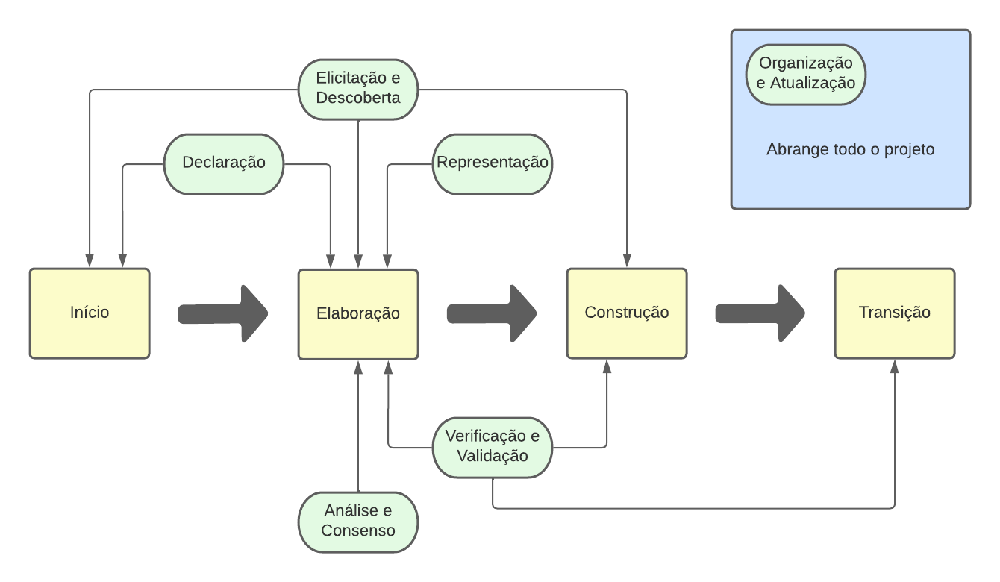

# Visão do Produto e Projeto

## Histórico de Revisão

| Data | Versão | Descrição | Autor |
|------|--------|-----------|-------|
| 26/04/23 | 0.1 | Início do documento | Equipe Mochileiros |
| 27/04/23 | 1.0 | Documento pronto para a Entrega 1 | Equipe Mochileiros |

## Sumário
---
- VISÃO GERAL DO PRODUTO

    - 1.1	Declaração de Posição do Produto
    - 1.2	Objetivos do Produto
    - 1.3	Tecnologias a Serem Utilizadas  
---
- VISÃO GERAL DO PROJETO

    - 2.1	Organização do Projeto
    - 2.2	Planejamento das Fases e/ou Iterações do Projeto
    - 2.3	Matriz de Comunicação
    - 2.4	Gerenciamento de Riscos
    - 2.5	Critérios de Replanejamento
---
- PROCESSO DE DESENVOLVIMENTO DE SOFTWARE

    - 3.1 Abordagem de desenvolvimento
        - 3.1.1 Requisitos
        - 3.1.2 Equipe de desenvolvimento
        - 3.1.3 Usuários
        - 3.1.4 Tipo de projeto e riscos associados
        - 3.1.5 Conclusão
    - 3.2 Escolhas de Engenharia de Requisitos
        - 3.2.1 Processo de ER
        - 3.2.2 Atividades de ER
---
- LIÇÕES APRENDIDAS

    - 4.1 Unidade 1
---
- REFERÊNCIAS BIBLIOGRÁFICAS
---

# VISÃO GERAL DO PRODUTO

## 1.1 Declaração de Posição do Produto

Estamos propondo o desenvolvimento de um site/app para gerenciamento de viagens, que permitirá que os usuários façam todo o planejamento de suas viagens em um único lugar, gerenciem pagamentos e dividam valores. O objetivo é proporcionar aos usuários uma experiência mais fácil, organizada e prática de planejamento de viagens, ao mesmo tempo em que ajuda a gerenciar as finanças e divisões de valores entre os membros do grupo de viagem.

O que torna este produto diferente dos concorrentes é a sua funcionalidade integrada de gerenciamento de pagamentos e divisão de valores, que permite os usuários calculem e gerenciem facilmente o quanto cada membro do grupo deve contribuir para despesas compartilhadas, como hospedagem, aluguel de carros e refeições. Além disso, nosso site/app fornecerá uma interface intuitiva e fácil de usar, tornando a experiência de planejamento de viagens mais agradável e eficiente para os usuários.

Nossos usuários-alvo são pessoas que viajam em grupos, como famílias, amigos ou colegas de trabalho. Eles são indivíduos que valorizam a conveniência e a organização em sua vida cotidiana e desejam a mesma facilidade e praticidade ao planejar suas viagens. Nossos clientes são aqueles que procuram uma solução integrada para gerenciar todas as suas necessidades de planejamento de viagens em um único lugar, economizando tempo e minimizando a possibilidade de erros.

Os clientes devem utilizar/comprar este produto porque ele oferece uma maneira eficiente e fácil de planejar e gerenciar viagens em grupo. Eles podem economizar tempo e esforço ao planejar sua viagem, bem como evitar erros e desentendimentos no gerenciamento de pagamentos e divisão de valores entre membros do grupo. Em resumo, nosso site/app oferece uma solução completa e integrada para o planejamento de viagens em grupo, tornando a experiência mais prática e agradável para os usuários.

| Pergunta | Resposta |
|----------|----------|
| Para | Famílias e viajantes em grupo |
| Quem | Busca uma solução fácil e organizada para o planejamento de viagens em grupo |
| O (nome do produto) | MóViagem |
| Que | Permite o planejamento completo de viagens em grupo e o gerenciamento de pagamentos e divisão de valores |
| Ao contrário | Os usuários precisam usar várias ferramentas diferentes para planejar suas viagens em grupo |
| Nosso produto | É uma plataforma integrada que oferece uma solução completa e fácil para o planejamento de viagens em grupo, com uma funcionalidade de gerenciamento de pagamentos e divisão de valores e uma interface intuitiva e fácil de usar |

## 1.2 Objetivos do Produto

O objetivo principal do nosso projeto é desenvolver uma plataforma online (site/app) para gerenciamento de viagens em grupo, com o intuito de facilitar o planejamento, organização e divisão de valores entre os membros do grupo.

Além disso, buscamos oferecer uma interface intuitiva e fácil de usar, para que os usuários possam planejar suas viagens sem dificuldade. A plataforma também permitirá que os usuários armazenem e gerenciem informações importantes de suas viagens, como voos, reservas de hotel e itinerários, em um único lugar.
Outro objetivo é permitir que os usuários convidem outros membros do grupo para participar do planejamento da viagem e gerenciar o acesso de cada um às informações. A ferramenta de comunicação integrada também será disponibilizada, para que os membros do grupo possam se comunicar facilmente durante o planejamento da viagem.

Por fim, queremos garantir que o processo de gerenciamento de pagamentos e divisão de valores seja simples e transparente, para que os membros do grupo não precisem lidar com cálculos complexos ou confusos. Com esses objetivos em mente, esperamos oferecer uma solução completa e eficiente para o planejamento de viagens em grupo.

## 1.3 Tecnologias a Serem Utilizadas

### Web
| Categoria | Tecnologias |
|-----------|-------------|
| Linguagem de programação | JavaScript, TypeScript |
| Framework de frontend | React |
| Backend | Node.js |
| Banco de Dados | MySQL |
| Hospedagem | Heroku |

### Mobile
| Categoria | Tecnologias |
|-----------|-------------|
| Linguagem de programação | JavaScript, TypeScript |
| Framework de frontend | React Native |
| Backend | Node.js |
| Banco de Dados | SQLite |
| Hospedagem | AWS |

# VISÃO GERAL DO PROJETO

## 2.1 Organização do Projeto

| Papel | Atribuições | Responsável | Participantes |
|-------|-------------|-------------|---------------|
| Arquiteto | Conduzir o design técnico do sistema documentando os aspectos arquiteturalmente significativos do sistema como visões que descrevem requisitos, design, implementação e distribuição | Eduardo | Eduardo |
| Gerente de projeto | Conduzir o time, avaliar os riscos e garantir que o projeto cumpra a necessidade dos stakeholders | Pedro | Pedro |
| Analista | Identificar, detalhar e consolidar requisitos, ajudar os stakeholders a escrever estórias | João | Todos |
| Testador | Criar casos de teste, scripts de teste e os executar de acordo com os critérios de aceitação de uma estória | Mateus | Todos |
| Desenvolvedor |Implementar o projeto em si, conversar com os outros papéis para seguir o planejamento e criar o produto certo | Gabriel | Todos |
| Stakeholder | Identificar requisitos, validar entregas, fornecer feedback, aprovar iterações e tomar decisões de negócios | Lucas Boaventura | Lucas, ChatGPT, Prof. George |

## 2.2	Planejamento das Fases e/ou Iterações do Projeto

| Fase | Produto (entrega) | Data Início | Data Fim |
|-------|-------------|-------------|---------------|
| Fase de concepção | Documento de visão do produto, planejamento inicial de riscos | 10/04/23 | 27/04/23 |
| Fase de elaboração | Arquitetura do projeto e Backlog | 28/05/23 | 25/05/23 |
| Fase de construção | Implementação das funcionalidades do produto | 26/05/23 | 10/07/23 |
| Fase de transição | Produto em produção | 11/07/23 | 18/07/23 |

## 2.3	Matriz de Comunicação

| Descrição | Área/Envolvidos | Periodicidade | Produtos Gerados |
|-------|-------------|-------------|---------------|
| Reunião de planejamento de iteração | Toda equipe, Stakeholder | A cada duas semanas | Plano de iteração, backlog atualizado |
| Reunião de alinhamento | Toda equipe | Uma vez por semana | Nenhum artefato, mas a equipe deve estar mais alinhada sobre o status das tarefas de cada pessoa do grupo |
| Revisão de iteração | Toda equipe | A cada duas semanas | Backlog atualizado, lista de riscos atualizada |
| Retrospectiva de iteração | Toda equipe | A cada duas semanas | Documento de visão do projeto atualizado (lições aprendidas) |

## 2.4	Gerenciamento de Riscos

- Trancamento de membros do projeto
- Modificação do Escopo
- A equipe não conseguiu cumprir os prazos
- Imprevistos diversos

## 2.5	Critérios de Replanejamento

Acontecerá o replanejamento do projeto caso ocorra:

- Não cumprimento dos prazos: Causará um replanejamento do cronograma das fases.
- Alterações graves de requisitos durante a fase de elaboração: Teremos mais iterações na fase de elaboração, causando o replanejamento do cronograma das fases.
- Saída de dois membros ou mais da equipe: Acarretará em diminuição do escopo.

# PROCESSO DE DESENVOLVIMENTO DE SOFTWARE

## 3.1 Abordagem de desenvolvimento

Para definir a abordagem de desenvolvimento de software que o projeto irá seguir, nos **baseamos** na metodologia proposta por Gupta (2019), tomando os resultados dela **somente como um norte**. Portanto foram respondidas questões sobre tópicos pré determinados para definir a abordagem que mais se adequa à equipe e ao projeto. Os tópicos são:

- Requisitos;
- Equipe de desenvolvimento;
- Usuários;
- Tipo de projeto e riscos associados.

Obs: Considere que, em resultados, cada caracter ‘+’ é a quantidade de vezes em que o processo especificado se encaixa com nosso projeto baseado em nossas respostas.

## 3.1.1 Requisitos

| Perguntas | Respostas |
|-----------|-------------|
| Os requisitos são fáceis de entender e definir? | Sim |
| Nós mudamos os requisitos com bastante frequência? | Não |
| Nós podemos definir os requisitos ao início de cada ciclo? | Sim |
| Os requisitos estão indicando um sistema complexo para se construir? | Sim |

### Resultados: 
- Cascata +++
- Protótipo +
- Incremental +++
- Evolutivo +++
- Espiral +
- RAD +++

## 3.1.2 Equipe de desenvolvimento

| Perguntas | Respostas |
|-----------|-------------|
| Pouca experiência em projetos similares? | Sim |
| Pouco conhecimento de domínio (novato na tecnologia)? | Não |
| Pouca experiência com as ferramentas que serão usadas? | Sim |
| Disponibilidade para treinamento, se necessário | Sim |

### Resultados: 
- Cascata +
- Protótipo ++
- Incremental +
- Evolutivo +
- Espiral ++
- RAD ++

## 3.1.3 Usuários

| Perguntas | Respostas |
|-----------|-------------|
| Usuário está envolvido em todas as fases? | Sim |
| Participação limitada do usuário? | Não |
| Usuário não tem experiência prévia de participações em projetos similares? | Sim |
| Usuário é especialista no domínio do problema? | Não |

### Resultados: 
- Cascata +
- Protótipo +++
- Incremental +
- Evolutivo ++
- Espiral ++
- RAD ++

## 3.1.4 Tipo de projeto e riscos associados

| Perguntas | Respostas |
|-----------|-------------|
| O projeto é a melhoria de um sistema existente? | Não |
| O financiamento é estável para o projeto? | Sim |
| Requisitos de alta confiabilidade? | Não |
| Cronograma do projeto é apertado? | Sim |
| Uso de componentes reutilizáveis? | Sim |
| Os recursos (Tempo, dinheiro, pessoas etc) estão escassos? | Não |

### Resultados: 
- Cascata +++
- Protótipo +++++
- Incremental +
- Evolutivo +
- Espiral ++++
- RAD +++++

## 3.1.5 Conclusão

- Cascata 8+
- Protótipo 11+
- Incremental 6+
- Evolutivo 7+
- Espiral 9+
- **RAD 12+**

Ao analisar os resultados individuais de cada tópico, foi obtida a metodologia de desenvolvimento mais adequada, o RAD (Rapid Application Development). Esta é uma abordagem ágil e tem como pontos característicos ser centrada no usuário e no design do produto, permitindo uma prototipagem mais rápida e uma entrega iterativa.

Levando em conta as peculiaridades da disciplina, decidimos desconsiderar o RAD e utilizar uma **abordagem híbrida baseada no OpenUP**. Pois assim, conseguimos trabalhar melhor os requisitos no início de nosso projeto e adequar nossas entregas com a disciplina. A estruturação de nossos requisitos será feita em **User Stories**.

## 3.2 Escolhas de Engenharia de Requisitos

## 3.2.1 Processo de ER

As facetas do processo de requisitos foram definidas seguindo o proposto pelo IREB (2022):

Ao fazer a análise do projeto, os facetas resultantes foram:

- Alvo: Orientado ao Mercado
    - Nossa solução é voltada para um grande número de pessoas, não um cliente específico. O nosso cliente servirá como um representante do público-alvo.

- Propósito: Exploratório
    - Nossos requisitos serão descobertos durante o projeto, sendo constantemente atualizados devido à: conversas com o cliente, implementação do código, ...

- Tempo: Iterativo
    - Feedback rápido para diminuir o risco e alterar os requisitos conforme necessário.

## 3.2.2 Atividades de ER

Conforme a divisão das atividades de Engenharia de Requisitos acima (MARSICANO, 2023), integramos as atividades de requisitos à metodologia de desenvolvimento de software do projeto, definida na seção 3.1.

# LIÇÕES APRENDIDAS

## 4.1 Unidade 1

Na unidade 1 foi possível ter uma introdução com relação aos processos de desenvolvimento de software. Na qual foi possível ver suas abordagens dirigidas a plano e ágeis em que  teve bastante enfoque na parte de ciclos de vida de um software como preditivo, iterativo, incremental, ágil e híbridos alguns exemplos práticos são Cascata, Spiral, RAD dentre outras. É dentro destes ciclos que é utilizado um  método de engenharia de requisitos de software, por isso foi importante essa introdução para que começássemos a entender sobre as atividades da engenharia de requisitos. Foi entendido também como definir o processo de desenvolvimento de um produto utilizando métodos como Sommerville e Gupta.

Outras lições foram entender as necessidades e desejos dos envolvidos, bem como entender melhor qual é de fato o problema a ser resolvido por meio da análise do problema fazendo o uso do diagrama de causa-efeito (fishbone) dentre outras ferramentas.

Para realizar um melhor projeto a partir da próxima etapa, uma possível melhoria seria uma melhor organização do tempo da equipe. Nesta unidade algumas entregas foram feitas muito em cima da hora, o que compromete a qualidade do trabalho. Portanto, a realização das atividades deve começar a ser realizada mais rápido nas próximas unidades.

# REFERÊNCIAS BIBLIOGRÁFICAS

Raja Gupta. Fundamentals of Software Engineering. Engineering Handbook. 2019. 

MARSICANO, George. Slides da matéria Requisitos. 2023

Handbook IREB CPRE Foundation Level, Version 1.1.0, september 2022
