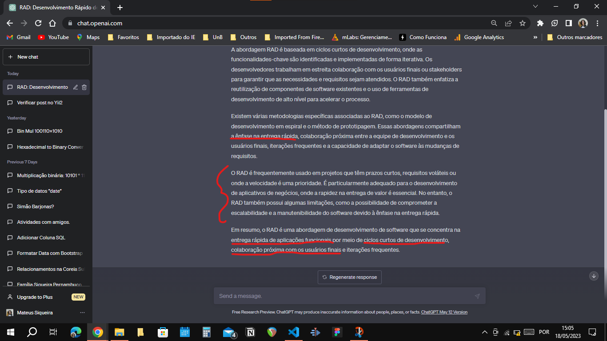

# Visão do Produto e Projeto

## Histórico de Revisão

 

| Data     | Versão | Descrição                         | Autor              |
| -------- | ------ | --------------------------------- | ------------------ |
| 26/04/23 | 0.1    | Início do documento               | Equipe Mochileiros |
| 27/04/23 | 1.0    | Documento pronto para a Entrega 1 | Equipe Mochileiros |
| 24/05/23 | 2.0pre | Documento pronto para a Entrega 2 | Equipe Mochileiros |
| 29/06/23 | 2.1    | Documento revisado após entrega 3 | Equipe Mochileiros |

  

## Sumário

 

- 1 VISÃO GERAL DO PRODUTO

  - 1.1 Problema
  - 1.2 Declaração de Posição do Produto
  - 1.3 Objetivos do Produto
  - 1.4 Tecnologias a Serem Utilizadas
      

- 2 VISÃO GERAL DO PROJETO

  - 2.1 Organização do Projeto
  - 2.2 Planejamento das Fases e/ou Iterações do Projeto
  - 2.3 Matriz de Comunicação
  - 2.4 Gerenciamento de Riscos
  - 2.5 Critérios de Replanejamento
      

- 3 PROCESSO DE DESENVOLVIMENTO DE SOFTWARE

  - 3.1 Abordagem de desenvolvimento
    - 3.1.1 Metodologia
    - 3.1.2 Questões técnicas
    - 3.1.3 Questões humanas
    - 3.1.4 Questões organizacionais
    - 3.1.5 Conclusão
  - 3.2 Escolhas de Engenharia de Requisitos - 3.2.1 Processo de ER - 3.2.2 Atividades de ER
      

- 4 LIÇÕES APRENDIDAS

  - 4.1 Unidade 1
      

- REFERÊNCIAS BIBLIOGRÁFICAS

  
  

## VISÃO GERAL DO PRODUTO

 

### 1.1 Problema

 

Tendo em vista que o projeto é desenvolvido com base em uma oportunidade identificada em relação a lacunas presentes nas soluções já existentes no setor de viagens, o projeto não apresenta um problema específico bem definido. A figura a seguir ilustra o diagrama Ishikawa, que enumera possíveis problemas enfrentados pelo público-alvo nas soluções já existentes e que podem ser solucionados por meio deste projeto.

.

No entanto, considerando que essa é uma área que abrange um número significativo de desafios e levando em consideração o prazo da disciplina, elaboramos uma lista das principais problemáticas que serão abordadas e solucionadas pelo projeto ao longo do período da disciplina:

- Dificuldade em manter as informações de viagens devidamente organizadas e centralizadas.
- Dificuldade em planejar atividades e verificar a disponibilidade dos membros da viagem.
- Dificuldade em manter uma comunicação eficiente e atualizada entre os membros da viagem.
    

### 1.2 Declaração de Posição do Produto

 

Estamos propondo o desenvolvimento de um site/aplicativo para o gerenciamento de viagens, que permitirá que os usuários realizem todo o planejamento de suas viagens em um único local, gerenciem pagamentos e dividam despesas. O objetivo é proporcionar aos usuários uma experiência mais fácil, organizada e prática no planejamento de viagens, ao mesmo tempo em que ajuda a gerenciar as finanças e divisões de despesas entre os membros do grupo de viagem.

O que torna este produto distinto em relação aos concorrentes é a sua funcionalidade integrada de gerenciamento de pagamentos e divisão de despesas, que permite aos usuários calcular e gerenciar facilmente a contribuição de cada membro do grupo para despesas compartilhadas, como hospedagem, aluguel de carros e refeições. Além disso, nosso site/aplicativo fornecerá uma interface que fará uso de técnicas de Interação Humano-Computador (IHC) com o objetivo de antecipar e prever possíveis ações do usuário antes que sejam executadas, a fim de tornar a experiência de planejamento de viagens mais agradável e eficiente.

Nossos usuários-alvo são pessoas que viajam em grupos, como famílias, amigos ou colegas de trabalho. São indivíduos que valorizam a conveniência e a organização em suas vidas cotidianas e desejam a mesma praticidade ao planejar suas viagens. Nossos clientes são aqueles que procuram uma solução integrada para gerenciar todas as suas necessidades de planejamento de viagens em um só lugar, economizando tempo e minimizando a possibilidade de erros.

Os clientes devem utilizar/comprar este produto porque ele oferece uma maneira eficiente e fácil de planejar e gerenciar viagens em grupo. Eles podem economizar tempo e esforço ao planejar suas viagens, além de evitar erros e desentendimentos no gerenciamento de pagamentos e divisão de despesas entre os membros do grupo. Em resumo, nosso site/aplicativo oferece uma solução completa e integrada para o planejamento de viagens em grupo, tornando a experiência mais prática e agradável para os usuários.

Isso diferencia o projeto de aplicações de organização e tarefas, como o Notion, que é uma aplicação de organização pessoal e não possui templates prontos para viagens, ou o Trello, que também é uma ferramenta de organização pessoal com foco principalmente no gerenciamento de projetos. Nosso projeto tem um enfoque maior, talvez exclusivamente, no processo de gerenciamento e organização de viagens.

É importante ressaltar que não consideramos agências de viagens, como a CVC ou decolar.com, como concorrentes, pois o projeto em questão visa suprir lacunas existentes nessas empresas.

| Pergunta            | Resposta                                                                                                                                                                                                             |
| ------------------- | -------------------------------------------------------------------------------------------------------------------------------------------------------------------------------------------------------------------- |
| Para                | Famílias e amigos                                                                                                                                                                                                    |
| Quem                | Busca uma solução integrada para o planejamento de viagens em grupo ou individuais                                                                                                                                   |
| O (nome do produto) | MóViagem                                                                                                                                                                                                             |
| Que                 | Gerencia a organização de uma viagem através de um controle de informações e de cronograma, além de recolher informações úteis sobre a situação do local da viagem                                                   |
| Ao contrário        | de outras ferramentas que oferecem somente algumas dessas funcionalidades, requisitando utilização de programas de terceiros                                                                                         |
| Nosso produto       | É uma plataforma integrada que oferece uma solução para o planejamento de viagens com a possibilidade de criar e compartilhar cronogramas com outras pessoas, receber avisos sobre clima e lembretes personalizados. |

  

### 1.3 Objetivos do Produto

 

O objetivo principal do nosso projeto consiste em desenvolver uma plataforma online (site/aplicativo) para o gerenciamento de viagens em grupo, com o intuito de facilitar o planejamento, a organização e a divisão de valores entre os membros do grupo.

Ademais, almejamos fornecer uma interface intuitiva, contendo os elementos essenciais para a gestão de uma viagem, de modo que os usuários possam planejar suas viagens de forma descomplicada. A plataforma permitirá que os usuários armazenem e gerenciem informações relevantes sobre suas viagens, como voos, reservas de hotéis e itinerários, tudo em um único local.

Outro objetivo consiste em possibilitar que os usuários convidem outros membros do grupo para participar do planejamento da viagem e gerenciar o acesso de cada um às informações. Não será necessário incluir uma ferramenta de comunicação integrada, visto que soluções já existentes desempenham esse papel de maneira eficiente. A menos que seja necessário um sistema de comunicação completamente integrado.

Por fim, embora o aspecto diferencial do projeto seja a capacidade de realizar cálculos financeiros, na primeira fase do desenvolvimento, focaremos em criar uma base sólida que permita a implementação dessa funcionalidade. Nosso objetivo é garantir que o processo de gerenciamento de pagamentos e divisão de valores seja simples, transparente e seguro, de modo que os membros do grupo não precisem lidar com cálculos complexos ou confusos. Com essas metas em mente, esperamos fornecer uma solução completa e eficiente para o planejamento de viagens em grupo.
  

### 1.4 Tecnologias a Serem Utilizadas

 

| Categoria                | Tecnologias            |
| ------------------------ | ---------------------- |
| Linguagem de programação | JavaScript, TypeScript |
| Framework de frontend    | React                  |
| Backend                  | Nest                   |
| Banco de Dados           | MySQL                  |
| Hospedagem               | Servidor VPS           |

  

## VISÃO GERAL DO PROJETO

 

### 2.1 Organização do Projeto

 

| Papel              | Atribuições                                                                                                  | Participantes                |
| ------------------ | ------------------------------------------------------------------------------------------------------------ | ---------------------------- |
| Gerente de projeto | Conduzir o time, avaliar os riscos e garantir que o projeto cumpra a necessidade dos stakeholders.           | Pedro                        |
| Desenvolvedor      | Implementar o projeto em si, criar arquitetura, testar, etc.                                                 | Todos                        |
| Stakeholder        | Identificar requisitos, validar entregas, fornecer feedback, aprovar iterações e tomar decisões de negócios. | Lucas, ChatGPT, Prof. George |

  

### 2.2 Planejamento das Fases e/ou Iterações do Projeto

 

| Fase                 | Produto (entrega)                                                         | Data Início | Data Fim |
| -------------------- | ------------------------------------------------------------------------- | ----------- | -------- |
| Fase de concepção    | Documento de Visão de Produto e Projeto, GitPages                         | 10/04/23    | 27/04/23 |
| Fase de elaboração   | Visão de Produto e Projeto, Backlog do Produto e Definição dos MVPs       | 28/04/23    | 25/05/23 |
| Fase de construção 1 | Visão de Produto e Projeto e Backlog atualizados, funcionalidades do MVP1 | 26/05/23    | 22/07/23 |
| Fase de construção 2 | Visão de Produto e Projeto e Backlog atualizados, funcionalidades do MVP2 | 23/07/23    | 20/07/23 |

  

### 2.3 Matriz de Comunicação

 

| Descrição                           | Área/Envolvidos                   | Periodicidade                     | Produtos Gerados                                                                                           |
| ----------------------------------- | --------------------------------- | --------------------------------- | ---------------------------------------------------------------------------------------------------------- |
| Reunião de planejamento de iteração | Toda equipe, Stakeholder, Monitor | Uma vez por semana                | Plano de iteração, backlog atualizado.                                                                     |
| Alinhamento individual              | Toda equipe                       | Duas vezes por semana no WhatsApp | Nenhum artefato, mas a equipe deve estar mais alinhada sobre o status das tarefas de cada pessoa do grupo. |
| Revisão de iteração                 | Toda equipe, Monitor              | Uma vez por semana                | Backlog atualizado, lista de riscos atualizada.                                                            |

  

### 2.4 Gerenciamento de Riscos

 

| **Risco**                     | **Causa**                                                                                                                         | **Probabilidade** | **Estratégia de mitigação**                                        |
| ----------------------------- | --------------------------------------------------------------------------------------------------------------------------------- | ----------------- | ------------------------------------------------------------------ |
| Atraso nas entregas           | Baixa produtividade dos membros da equipe e/ou dimensionamento incorreto do escopo da iteração e dos MVPs                         | Alta              | Melhorar a gestão, reformular e redistribuir as tarefas pendentes. |
| Redução da equipe             | Trancamento da disciplina ou qualquer questão pessoal que impeça, de forma permanente ou temporária, a realização das atividades. | Baixa             | Redistribuição do trabalho entre os integrantes restantes.         |
| Falha na comunicação interna  | Falhas de comunicação entre os integrantes que podem causar intercorrências e mal-entendidos                                      | Média             | Repensar as formas de comunicação entre os integrantes.            |
| Mudança no escopo             | Atraso nas entregas ou alterações no backlog a pedido do cliente.                                                                 | Média             | Replanejamento do escopo existente.                                |
| Inviabilidade de um requisito | Requisitos que não podem ser implementados por questões técnicas ou de negócio.                                                   | Baixa             | Replanejamento do escopo existente.                                |
| Equipamento danificado        | Danos físicos ou virtuais nos equipamentos utilizados para o desenvolvimento do projeto.                                          | Baixa             | Redistribuição do trabalho entre os integrantes restantes.         |

  

### 2.5 Critérios de Replanejamento

 

Acontecerá o replanejamento do projeto caso ocorra:

- Não cumprimento dos prazos: Causará um replanejamento do cronograma das fases.
- Alterações graves de requisitos durante a fase de elaboração: Teremos mais iterações na fase de elaboração, causando o replanejamento do cronograma das fases.
- Saída de dois membros ou mais da equipe: Acarretará em diminuição do escopo.
    

## PROCESSO DE DESENVOLVIMENTO DE SOFTWARE

 

### 3.1 Abordagem de desenvolvimento

 

### 3.1.1 Metodologia

 

Em um primeiro momento, nós decidimos utilizar a metodologia proposta por Gupta (2019), porém após um estudo da metodologia RAD, nós não ficamos satisfeitos com o resultado, pois ela não se encaixava na configuração da disciplina. Apesar de toda a base introdutória mostrando-se favorável para a implementação do ciclo de vida RAD com o GUPTA. Foi feita uma reunião de Brainstorm com os membros da equipe com auxílio do Chat-GPT da OpenAI para nos auxiliar nesse processo de concepção do ciclo de vida que mais se adapta ao projeto levando em consideração os seguintes pontos:

- O foco da disciplina (Requisitos de Software)
- O planejamento da disciplina que contém duas entregas de MVP ao final da disciplina.
- Disponibilidade dos membros da equipe.

O GUPTA nos sugeriu o RAD, porém o RAD é uma abordagem centrada no cliente e com entregas recorrentes, o que não é condizente com o projeto em questão, não possuímos um cliente bem definido exploramos uma oportunidade de mercado.

A abordagem utilizada originalmente está presente nesta página: [Abordagem de Gupta](https://mdsreq-fga-unb.github.io/2023.1-MoViagem/documentos/abordagem-gupta/)

Depois de debates e em pesquisas feitas fazendo uso do chatGPT, mas não somente ele, decidimos desconsiderar o RAD e utilizar uma **abordagem híbrida baseada no OpenUP**. Pois assim, conseguimos trabalhar melhor os requisitos no início de nosso projeto e adequar nossas entregas com a disciplina. Além disso, temos também um maior proveito no que tange ao foco nas áreas específicas do desenvolvimento dando foco maior pela fase de engenharia de requisitos. É importante ressaltar que a estruturação de nossos requisitos será feita em **User Stories**.

Para validar essa escolha utilizamos a metodologia de Sommerville. O processo foi especificado abaixo:
  

### 3.1.2 Questões técnicas

- Qual é o tamanho do sistema que está sendo desenvolvido?
  - O sistema é de pequeno porte pois não possui muitas funcionalidades e não deverá precisar de manutenção após a entrega.
- Que tipo de sistema está sendo desenvolvido?
  - É um sistema web.
- Qual é a vida útil prevista para o sistema?
  - 2 meses.
- O sistema está sujeito a controle externo?
  - Não.
      

### 3.1.3 Questões humanas

- Qual é o nível de competência dos projetistas e programadores do time de desenvolvimento?
  - O nível é bom, todos os integrantes já possuem experiência com desenvolvimento web.
- Como está organizado o time de desenvolvimento?
  - Temos um time pequeno com 5 integrantes, todos com experiência em desenvolvimento web, porém com pouco tempo disponível para o projeto.
- Quais são as tecnologias disponíveis para apoiar o desenvolvimento do sistema?
  - ChatGPT, GitHub, Visual Studio Code, Figma, framework Javascript para desenvolvimento web.
      

### 3.1.4 Questões organizacionais:

- É importante ter uma especificação e um projeto (design) bem detalhados antes de passar para a implementação — talvez por motivos contratuais?
  - Não, não há motivos contratuais e nem da disciplina para isso.
- É realista uma estratégia de entrega incremental, na qual o software é entregue aos clientes ou outros stakeholders e um rápido feedback é obtido?
  - É realista, mas como a disciplina prevê apenas duas entregas no final do semestre, não é possível fazer entregas incrementais.
- Os representantes do cliente estarão disponíveis e dispostos a participar do time de desenvolvimento?
  - Sim, o cliente tem contato frequente com um dos integrantes do time de desenvolvimento mas não tem disponibilidade para participar do time.
- Existem questões culturais que possam afetar o desenvolvimento do sistema?
  - Não.
      

### 3.1.5 Conclusão

 

Considerando as respostas das questões acima, a metodologia mais adequada para o projeto é uma abordagem híbrida orientada a plano (graças ao foco maior da disciplina em engenharia de requisitos) com algumas características das metodologias ágeis como a priorização de requisitos (tempo curto de desenvolvimento), a programação em pares (bom conhecimento da equipe), iterações curtas e reuniões frequentes (o cliente tem contato frequente).

Segue uma imagem de uma validação feita com o ChatGPT:

Podemos validar nossa escolha do OpenUP com a metodologia de Sommerville, pois o OpenUP é uma metodologia híbrida que se encaixa perfeitamente com as respostas das questões acima, podendo ser adaptada para o projeto.
  

### 3.2 Escolhas de Engenharia de Requisitos

 

### 3.2.1 Processo de ER

 

As facetas do processo de requisitos foram definidas seguindo o proposto pelo IREB (2022):

Ao realizar a análise do projeto, as facetas resultantes foram:

- Alvo: Orientado ao Mercado
  - Nossa solução é direcionada a um amplo público, e não a um cliente específico. Nosso cliente atuará como representante do público-alvo.
- Propósito: Exploratório
  - Nossos requisitos serão descobertos durante o projeto, sendo constantemente atualizados devido a conversas com o cliente, implementação do código, etc.
- Tempo: Iterativo
  - Buscamos obter um feedback rápido para reduzir riscos e realizar alterações nos requisitos conforme necessário.
      

### 3.2.2 Atividades de ER

 

Conforme a divisão das atividades de Engenharia de Requisitos mencionada acima (MARSICANO, 2023), integramos as atividades de requisitos à metodologia de desenvolvimento de software adotada pelo projeto, conforme definido na seção 3.1.

  

## LIÇÕES APRENDIDAS

 

### 4.1 Unidade 1

 

Na Unidade 1, foi possível obter uma introdução aos processos de desenvolvimento de software, abordando as abordagens planejadas e ágeis, com destaque para os ciclos de vida do software, como preditivo, iterativo, incremental, ágil e híbrido, mencionando exemplos práticos como Cascata, Spiral, RAD, entre outros. Esses ciclos são onde o método de engenharia de requisitos de software é aplicado, o que tornou essa introdução importante para o entendimento das atividades da engenharia de requisitos. Também foi abordado como definir o processo de desenvolvimento de um produto, utilizando métodos como Sommerville e Gupta.

Outras lições abordaram a compreensão das necessidades e desejos dos envolvidos, bem como a compreensão mais aprofundada do problema a ser resolvido por meio da análise do problema, utilizando ferramentas como o diagrama de causa e efeito (espinha de peixe), entre outras.

Para melhorar o planejamento na próxima etapa do projeto, uma possível melhoria seria uma organização mais eficiente do tempo da equipe. Nesta unidade, algumas entregas foram realizadas em cima da hora, comprometendo a qualidade do trabalho. Portanto, é importante que as atividades sejam iniciadas mais cedo nas próximas unidades, a fim de garantir a qualidade e o cumprimento dos prazos.
  

### 4.2 Unidade 2

 

Na unidade 2, foi introduzida as atividades da engenharia de requisitos, abordando todos os seus processos e técnicas as quais são: Elicitação e Descoberta, Análise e Consenso, Declaração, Representação, Verificação e Validação e Organização e Atualização.

Na disciplina foram realizados diversas abordagens para debate do conteudo da unidade 2 como, juris para análise de cenários, avaliações entre os grupos entre outras atividades.

Para o grupo, a unidade 2 foi de extrema importância para a equipe, pois com o cilo de vida escolhido conseguimos nos organizar melhor para nos reunirmos e utilizarmos de todas as atividades da engenharia de requisitos, o que foi muito proveitoso pois evoluimos bastante como equipe na prática dessas atividades.

Algo importante a se destacar é da ferramenta como chatGPT que foi utilizada como auxiliador na prática das atividades de engenharia de requisitos, o que nos concedeu um importante stakeholder aliado aos feedbacks do professor.
  

### 4.3 Unidade 3

 

Na unidade 3, foi introduzida os metodos de construção de backlog PBB E BDD que consiste em metodos que auxiliam na construção do Product Backlog. Também foi iniciada o processo de deselvovimento do produto de sotware representado pelo nosso backlog.

Na disciplina foram realizadas aulas de trabalho com o grupo para a construção do Canvas PBB, BDD e Backlog Safe.

Para o grupo, a unidade 3 foi muito proveitosa e trabalhosa na mesma proporção. Lidar com as atividades de Engenharia de requisitos e também lidar com os problemas da implementação foi um grande desafio para todos da equipe. O que nos demandou um trabalho em equipe bem estruturado. O grupo sofreu um pouco com um dos riscos levantados no gerenciamento, que foi a ausencia de alguns integrantes por motivos de problemas de saude que impactou um pouco no ritmo de desenvolvimento, mas que foi sanado com esforço a mais de todos.

  

## REFERÊNCIAS BIBLIOGRÁFICAS

 

Raja Gupta. Fundamentals of Software Engineering. Engineering Handbook. 2019.

MARSICANO, George. Slides da matéria Requisitos. 2023

Handbook IREB CPRE Foundation Level, Version 1.1.0, september 2022
